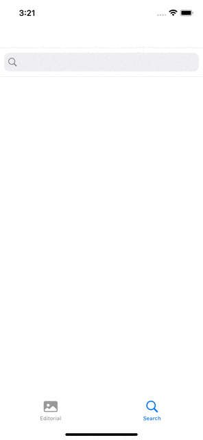
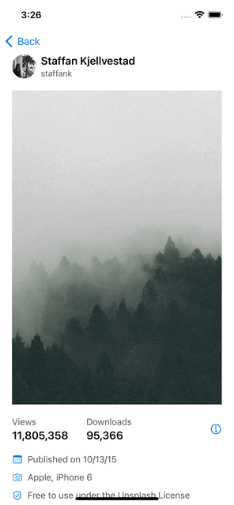

# Unsplash Demo App (개인 프로젝트)

## 사용된 기술

- RxSwift, RxCocoa, SnapKit, Kingfisher
- UICollectionViewLayout, UIViewPropertyAnimator, UIGestureRecognizer
- MVVM 아키텍쳐

## 구현 내용

### 이미지 크기에 따른 Dynamic Cell Size

이미지의 Aspect Ratio를 계산하여 Cell Size를 Dynamic하게 조절한다. 열 개수와 Padding 값을 조절할 수 있도록 작성해 Search에서도 동일한 CollectionViewLayout을 사용한다.

### 검색 시 자동완성

### 무한 스크롤과 Dynamic Cell Size

하단으로 계속 스크롤하면 추가 검색결과를 로드하며 Daynamic Cell Size를 계속 적용한다.

### Half Modal과 Gesture

화면 전체를 가리지 않는 Half Modal View와 함께 Gesture를 적용해 아래로 스크롤하여 Modal을 닫을 수 있다. 드래그하는 위치에 맞추어 View가 이동하기 때문에 제스쳐를 통한 상호작용이 가능함을 사용자가 알 수 있다.